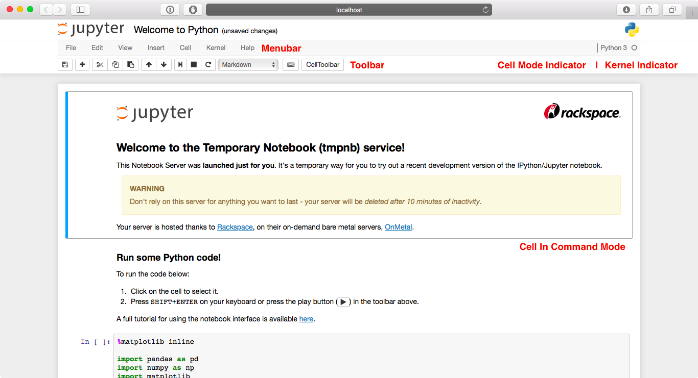

# 用户界面组件
当打开错误报告或将电子邮件发送到Jupyter邮件列表时，了解不同UI组件的名称非常有用，这样其他开发人员和用户可以更轻松地帮助您诊断问题。 本节将使您熟悉笔记本中的UI元素名称和不同的Notebook模式。

# 笔记本仪表板(Notebook Dashboard)
当您启动`jupyter`笔记本时，您遇到的第一页是Notebook Dashboard。.

# 笔记本编辑器

一旦你选择了一个笔记本进行编辑，笔记本可以在笔记本编辑器中打开

## 笔记本的交互式用户界面浏览
如果您想了解有关笔记本编辑器中的特定元素的更多信息，可以通过选择菜单栏中的“帮助”，然后选择“用户界面游览”来浏览用户界面游览。

# 编辑模式和笔记本编辑器
当一个单元处于编辑模式时，单元模式指示器将改变以反映单元的状态。 该状态由界面右上角的小铅笔图标表示。 当单元格处于命令模式时，该位置没有图标。

# 文件编辑器
现在让我们假设您选择在Notebook Dashboard中打开一个Markdown文件而不是Notebook文件。 如果是这样，该文件将在文件编辑器中打开。

